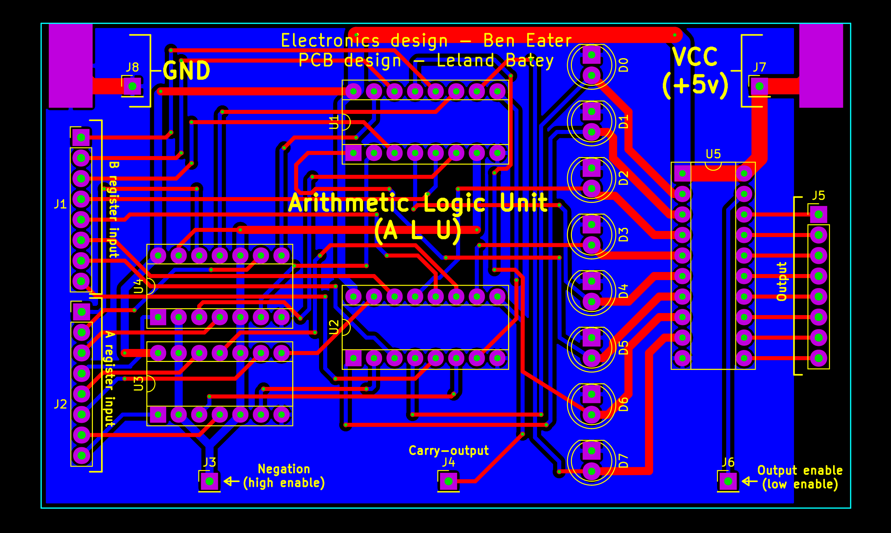

Arithmetic Logic Unit (ALU)
===========================

This repo contains PCB designs for the third component of Ben Eater's
educational 8-bit CPU, the arithmetic logic unit or ALU. You can [watch Mr.
Eaters *fantastic* series on designing and building this CPU on his Youtube
channel.](https://www.youtube.com/user/eaterbc/videos)

